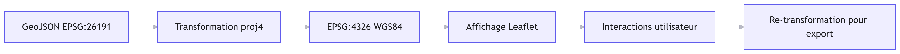
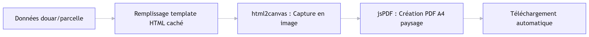
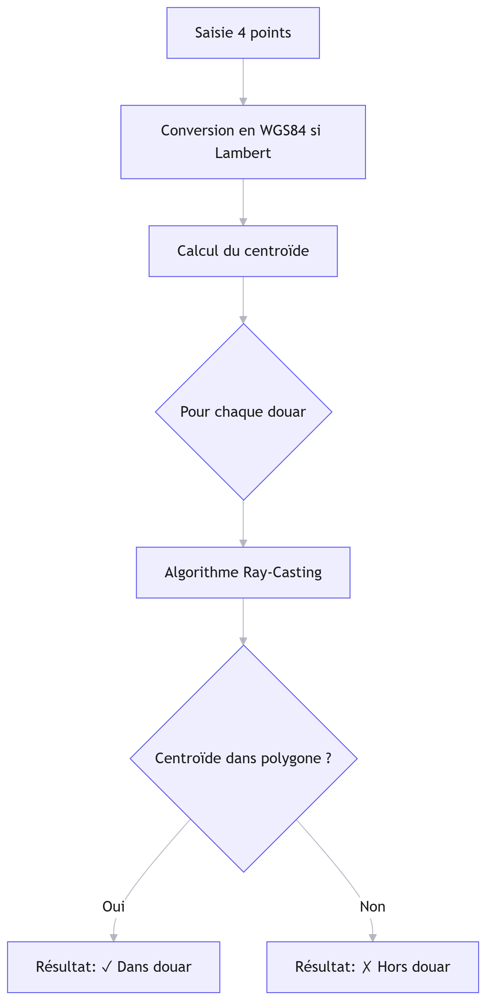

# 🗺️ Dashboard - Délimitation des Douars

> Application web interactive de visualisation, consultation et export de données cartographiques des douars - Maroc Nord (Projection Merchich Maroc Nord 1 - EPSG:26191)

**Développé par** : Mousab OUALLA  
**Année** : 2026  
**Agence** : Agence Urbaine d'El Jadida - Sidi Bennour

---
## Processus 




---

## 📋 Table des matières

1. [Présentation](#-présentation)
2. [Fonctionnalités](#-fonctionnalités)
3. [Prérequis techniques](#-prérequis-techniques)
4. [Installation et lancement](#-installation-et-lancement)
5. [Guide d'utilisation](#-guide-dutilisation)
6. [Structure des données](#-structure-des-données)
7. [Processus techniques](#-processus-techniques)
8. [Dépannage](#-dépannage)
9. [Licence](#-licence)

---

## 🎯 Présentation

Cette application permet aux agents de l'Agence Urbaine de :
- ✅ Visualiser les limites des douars sur une carte interactive
- ✅ Consulter les attributs administratifs (Code, Commune, Cercle, Province, Surface)
- ✅ Rechercher par texte ou par coordonnées (Lambert Nord 1 ou WGS84)
- ✅ Filtrer les douars par multiples critères
- ✅ Vérifier si une parcelle saisie manuellement se trouve dans un douar
- ✅ Générer des fiches techniques PDF professionnelles pour chaque douar ou parcelle

---

## ✨ Fonctionnalités

### 🗂️ Gestion des couches
| Fonctionnalité | Description |
|---------------|-------------|
| **Fonds de carte** | 4 options : OpenStreetMap, Satellite, Topographique, Sombre |
| **Couches thématiques** | Activation/désactivation des couches : Douars, Communes, Provinces |
| **Légende dynamique** | S'affiche automatiquement selon les couches actives |

### 🔍 Recherche et consultation
| Fonctionnalité | Description |
|---------------|-------------|
| **Recherche textuelle** | Filtrage en temps réel par nom, code, commune, province |
| **Recherche par coordonnées** | Saisie Lambert (X/Y en mètres) ou WGS84 (Lat/Lon) avec localisation automatique |
| **Tableau interactif** | Liste des douars avec clic pour zoomer et ouvrir le modal détails |
| **Barre de coordonnées** | Affichage en temps réel des coordonnées sous la souris (Lambert + WGS84) |

### 🎛️ Filtrage multi-critères
| Critère | Type | Exemple |
|---------|------|---------|
| Nom du Douar | Texte | "Douar A" |
| Code | Texte | "001" |
| Commune | Texte | "Sidi Bennour" |
| Province | Texte | "El Jadida" |
| Surface Min/Max | Numérique (ha) | 10 - 500 |

✅ Validation automatique (Min < Max)  
✅ Messages d'erreur/succès clairs  
✅ Mise à jour dynamique de la carte

### 📐 Localisation de parcelle
| Étape | Action |
|-------|--------|
| 1️⃣ | Choisir le système de coordonnées (Lambert ou WGS84) |
| 2️⃣ | Saisir 4 points minimum (8 champs : X/Y ou Lon/Lat) |
| 3️⃣ | Cliquer "Ajouter les points" → Polygone s'affiche sur la carte |
| 4️⃣ | Cliquer "Vérifier la parcelle" → Résultat : ✓ Dans un douar / ✗ Hors douar |
| 5️⃣ | Exporter le rapport en PDF si nécessaire |

🔍 **Algorithme utilisé** : Ray-Casting pour une vérification spatiale fiable, avec calcul du centroïde pour éviter les faux négatifs aux limites.

### 📄 Export PDF professionnel
| Type | Contenu du PDF |
|------|---------------|
| **Fiche Douar** | En-tête officiel, carte centrée, tableau des sommets (Lambert), métadonnées (Code, Commune, Surface, Projection), date, signatures |
| **Rapport Parcelle** | Résultat de vérification, coordonnées des points, carte de la parcelle, date de génération |

📐 Format : A4 paysage | 🖨️ Compatible impression | 🌐 Bilingue Arabe/Français (en-tête)

---

## ⚙️ Prérequis techniques

### Navigateurs supportés
- ✅ Chrome 90+
- ✅ Firefox 88+
- ✅ Edge 90+
- ✅ Safari 14+

### Dépendances (chargées via CDN)
```html
<!-- Cartographie -->
<link rel="stylesheet" href="https://unpkg.com/leaflet@1.9.4/dist/leaflet.css" />
<script src="https://unpkg.com/leaflet@1.9.4/dist/leaflet.js"></script>

<!-- Projection -->
<script src="https://cdnjs.cloudflare.com/ajax/libs/proj4js/2.9.2/proj4.js"></script>

<!-- Export PDF -->
<script src="https://cdnjs.cloudflare.com/ajax/libs/jspdf/2.5.1/jspdf.umd.min.js"></script>
<script src="https://cdnjs.cloudflare.com/ajax/libs/html2canvas/1.4.1/html2canvas.min.js"></script>

<!-- Icônes -->
<link rel="stylesheet" href="https://cdnjs.cloudflare.com/ajax/libs/font-awesome/6.4.0/css/all.min.css" />


